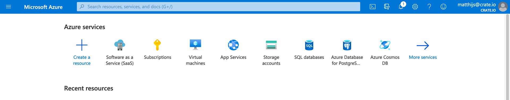
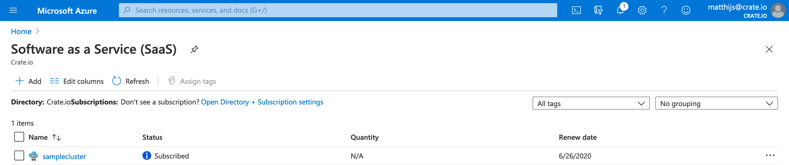
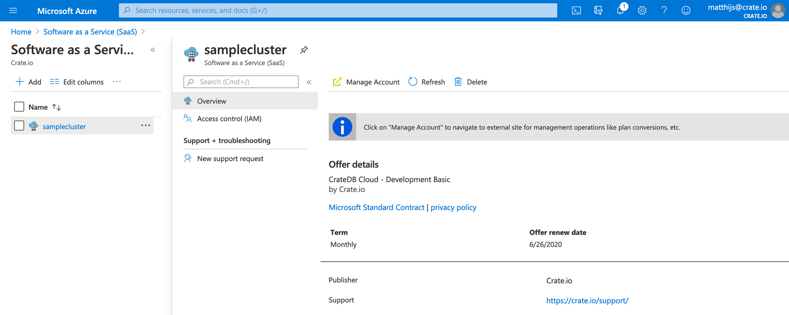
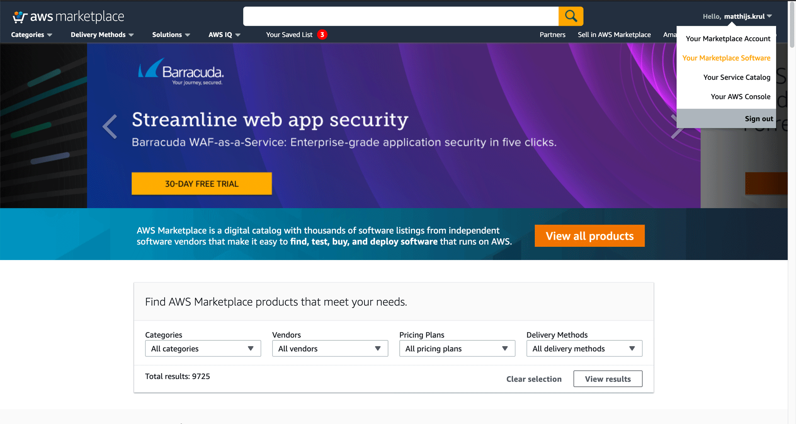
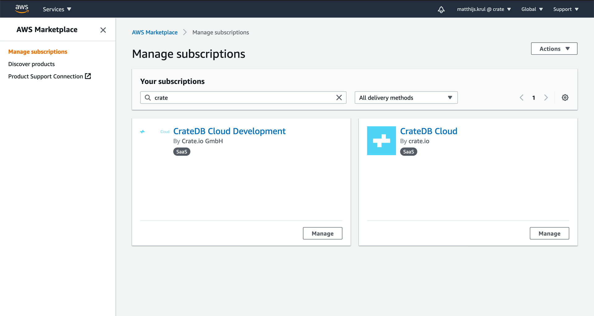
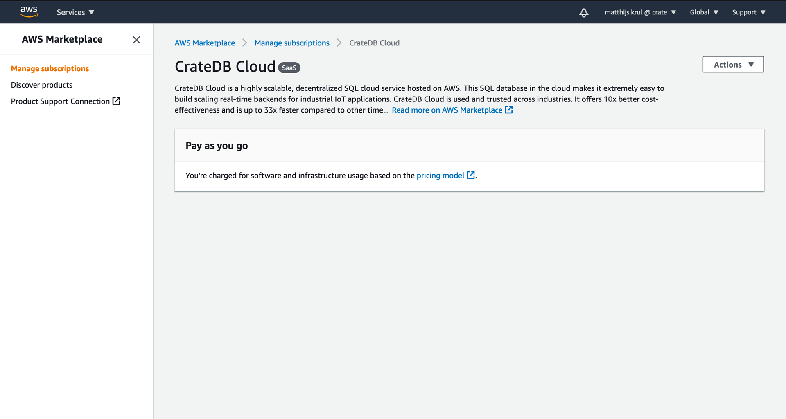

(delete-cluster)=
# Delete cluster

This is a guide on how to delete a CrateDB Cloud cluster. It consists of
two parts: one describes the process of deleting a cluster created
through Microsoft Azure, the other is for a cluster created through AWS.
For Azure, there are in turn two methods: via the CrateDB Cloud Console
and through the Azure Portal. Each are outlined in the Azure section.

:::{Warning}
All cluster data will be lost on deletion. This action cannot be undone.
:::

(delete-cluster-azure)=
## Microsoft Azure 

If you followed the steps of the {ref}`tutorial on how to set up a cluster
from scratch via Microsoft Azure <signup-azure-to-cluster>`, 
you should have a cluster running now. If you created your
CrateDB Cloud cluster via the Microsoft Azure offering, you have two
different ways to delete a cluster, once it has been created. The first
is through the CrateDB Cloud Console itself, the second is via the
Microsoft Azure SaaS listing. We will describe each process below.

(delete-cluster-az-console)=
### Deleting a cluster via the CrateDB Cloud Console 

The easiest and preferred way to delete a cluster is via the CrateDB
Cloud Console. Make sure you are logged in to the Console with a user
that has admin access in the organization where your cluster is
deployed. For more on what that means, please see the documentation on
{ref}`user roles. <user-roles>`

First, you need to select the cluster in question. To do this, we need
to access the Clusters page in the left-hand sidebar. There you should
see a list of all your clusters.

Simply click the \"View\" button on the one you want to delete. This
will bring you to the overview of said cluster. There will be a \"Delete
cluster\" button in the top right corner. After clicking this button,
you will be prompted to input the name of the cluster to avoid
accidental deletion of your cluster. After you submit by clicking
*Confirm*, your cluster will be deleted.

(delete-cluster-az-portal)=
### Deleting a cluster via the Microsoft Azure Portal 

As an alternative option, you can also delete a cluster - once
deployment has been confirmed in the CrateDB Cloud Console - directly
via the Microsoft Azure Portal. If you followed the previous tutorial on
deploying a cluster from scratch using the Azure Marketplace, you will
already be familiar with it.

To delete a cluster via the Azure Portal, first we must head to the
[Azure Portal homepage](https://portal.azure.com/). Make sure you are
logged in with the correct account while on this page.

If all is well, you should be able to see a section titled *Azure
Services* on the landing page. If you have recently used a SaaS
resource, you should find in this overview the item \"Software as a
Service (SaaS)\". If this item is not present in the list, go to the
search bar at the top (which says *search resources, services, and
docs*) and enter \"SaaS\" there. The SaaS item should then appear in the
list of results.

Click on this icon. If you have subscribed to the CrateDB Cloud offer
and have deployed a cluster previously, the cluster name should now
appear in the list of SaaS items.

All that remains is to click directly on the relevant cluster name (you
do not need to tick the box). This will take you to a screen with
cluster details.

To delete the cluster, press the *Delete* button at the top right and
confirm.

(delete-cluster-aws)=
## AWS 

(delete-cluster-aws-marketplace)=
### Deleting a cluster via the AWS Marketplace 

You can deploy a cluster on CrateDB Cloud via AWS by subscribing to the
offering on the [AWS
Marketplace](https://aws.amazon.com/marketplace/pp/B089M4B1ND). The
offer will refer you to the CrateDB Cloud wizard where you can configure
your plan and cluster. Finally, this process will lead you to the
CrateDB Cloud Console.

To delete a cluster created in this way, you must unsubscribe from the
AWS Marketplace offer. To do so, go to the AWS Marketplace website and
make sure you are logged in with the account that you used to subscribe
to the offer.

On the landing page, find your account name in the top right corner, and
in the dropdown menu, select *Your Marketplace Software*.

This will take you to an overview of your AWS Marketplace subscriptions.
You should see CrateDB Cloud there. Each subscription item has a button
labeled *Manage*. Click this button for CrateDB Cloud.

You will now see a page with the CrateDB Cloud \"pay as you go\" offer
on it. At the top right corner there is a button labelled *Actions*.

This generates a drop-down menu with various options for interacting
with the offer. In this menu, click the option *Cancel subscription*.

A warning will appear stating that canceling the subscription will not
terminate your running services. Do not worry: upon receiving a notice
of cancellation of the subscription, the CrateDB Cloud team will
terminate your running services for you. Therefore, you can safely
cancel your subscription at this prompt to delete your cluster.

(delete-cluster-billing)=
## Billing 

Crate.io only bills for actual cluster usage. During cluster operation,
this is on a per-hour basis. As soon as the cluster is deleted, nothing
further will be billed for that cluster.