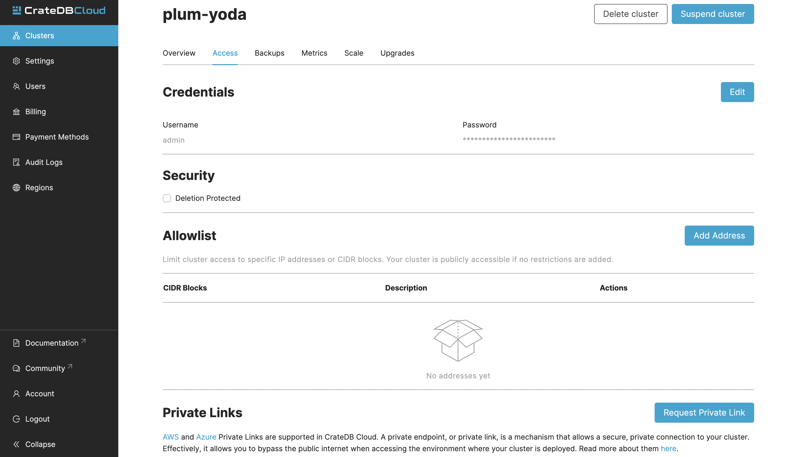

(private-endpoints)=
# Configure private endpoint 

A private endpoint, or private link, is a mechanism that allows a
secure, private connection to your cluster. Effectively, it allows you
to bypass the public internet when accessing the environment where your
cluster is deployed.

To create a private endpoint, you need to deploy a cluster first. To do
that, go to the [Cloud Console](https://console.cratedb.cloud/).

Enabling private endpoints takes some configuration from our side, so
the first step is contacting us. To do that, navigate to the "Access"
tab of your cluster.



On the "Access" tab, you will find a "Private Link" section at the
bottom. In order to request a private link, select *Request Private
Link*. Fill out the requested information and select *OK*. We will get
back to you as soon as possible.

````{note}
Private endpoints do not work across providers, meaning that if you want
to securely access your AWS cluster, you must do so from within the AWS
environment.
````
