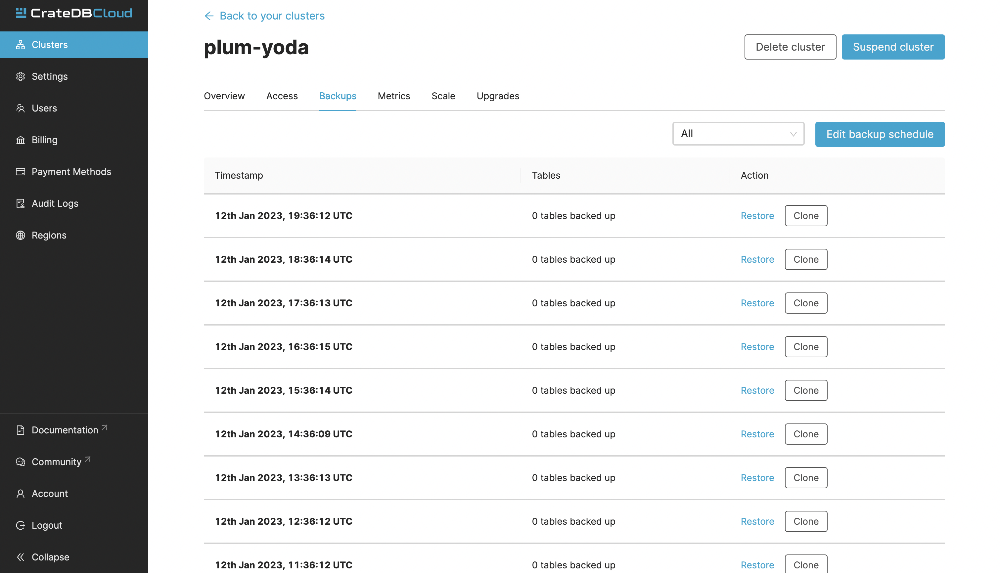

(restore-backups)=
# Restore backups

This short guide explains in general terms the CrateDB Cloud backup
policy for automatically generating snapshots of the cluster data and
how one can use such snapshots to restore data. A more detailed
technical discussion of how CrateDB handles snapshots can be found in
the CrateDB documentation about {ref}`snapshots. <crate-reference:snapshot-restore>`

You may also want to read the full Cloud reference documentation on
{ref}`backups. <overview-cluster-backups>`

(snapshot-backup)=
## CrateDB Cloud's backup policy 

CrateDB Cloud takes *hourly snapshots* which are kept for *14 days*.

(snapshot-restore)=
## Restore a snapshot 

Once a snapshot of a table or partition has been created, it can be
restored. Restoring a snapshot resets that table or partition to the
state it was in when that snapshot was created. The relevant current
table or partition is dropped and replaced by its corresponding table or
partition from the snapshot.

To restore a snapshot, first, navigate to the Clusters page and click
*View* on the relevant cluster. This will bring you to the Overview page
of your cluster.

From here, navigate to the Backups tab. Here you can see all your
existing snapshots.

To restore a specific snapshot, click the *Restore* button next to the
snapshot. A window with a SQL statement will appear. Clicking the *Run
query in Admin UI* will take you to the Admin UI console and input the
statement for you. Once you run it, the snapshot will be restored.