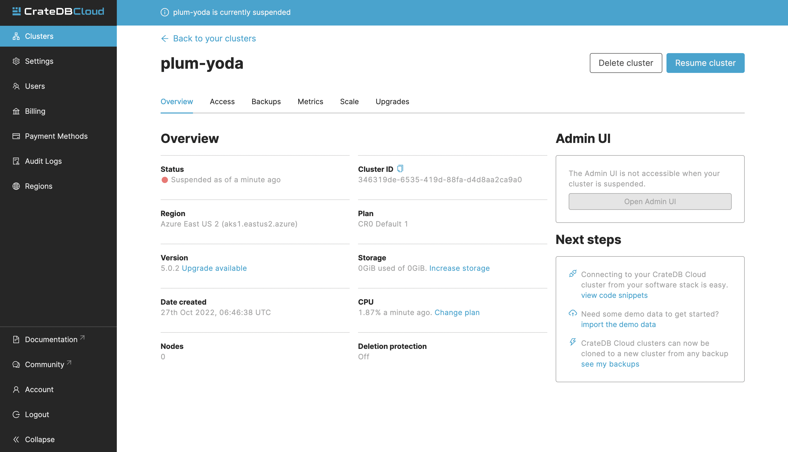

(suspend-cluster)=
# Suspend cluster

This guide will provide a quick overview of how to suspend your cluster
using the CrateDB Cloud Console. For the purposes of this guide, it is
assumed that you have a cluster up and running and can access the
Console. If not, please refer to the tutorial on how 
to {ref}`deploy a cluster for the first time. <deploy-cluster>`

(what-is-suspension)=
## What is cluster suspension

Cluster suspension is a feature that enables you to temporarily pause
your cluster while retaining all its data. An example situation might be
that the project you\'re working on has been put on hold. The cost of
running a cluster is split into two parts: **Compute** and **Storage**.
The benefit here is that while the cluster is suspended, you are only
charged for the storage.

(cluster-suspend-steps)=
## Steps to suspending the cluster 

To suspend your cluster, navigate to the Clusters page in the left-hand
menu. Here you can see a list of all your clusters. Click *View* on the
cluster you wish to scale.

This will bring you to the Overview page of your chosen cluster.

Once here, you can suspend your cluster. Simply click the *Suspend
cluster* in the top-right.

(how-to-resume-a-cluster)=
## Resume a cluster 

To resume your cluster, simply click the *Resume cluster* button in the
top-right while in the Overview page of your cluster.

(additional-info)=
## Important things to know 

-   To suspend a cluster, you must be an organization Admin.
-   You can suspend and resume clusters at any time.
-   While your cluster is suspended, you will still be billed for the
    storage and the billing cycle is unaffected.
-   Cluster backups do not expire while a cluster is suspended.
-   The Admin UI of a cluster is unavailable while the cluster is
    suspended.