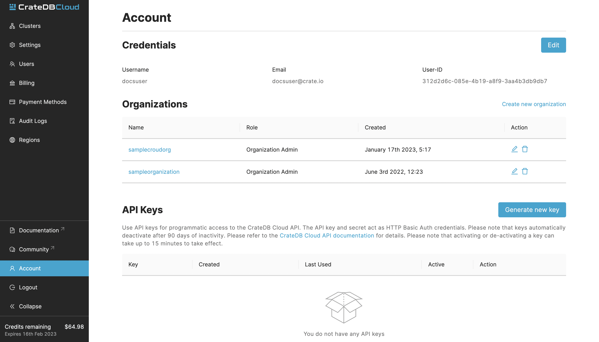

(organization-api)=
# API

We offer an API to allow programmatic access to CrateDB Cloud. The API can
be accessed by generating a key and secret in your
[account page](https://console.cratedb.cloud/account/settings) (login required).

The API keys are bound to the CrateDB Cloud user account that generates them. 
This means that any actions performed using the API keys will be executed as
that user. Consequently, the API keys inherit the same permissions as the user,
allowing the same level of access and control over the organization and its
resources.

Click the *Generate new key* button to create your key. A popup with
your key and secret will appear. Make sure to store your secret safely,
as you cannot access it again.

(api-access)=
## Access

The key and secret can be used as HTTP Basic Auth credentials when
calling the API, e.g.

:::{code} console
sh$ $ curl -s -u $your_key:$your_secret https://console.cratedb.cloud/api/v2/users/me
:::

This example will return details of the current user:

:::{code} console
{"email":"some@example.com","hmac":"...","is_superuser":false,"name":"Some User","organization_id":"123","status":"active","uid":"uid","username":"some@example.com"}
:::

(api-examples)=
## Examples

The API is documented with
[Swagger](https://console.cratedb.cloud/api/docs) (login required). It
contains endpoints for:

-   Organizations
-   Regions
-   Projects
-   Clusters
-   Products
-   Users
-   Roles
-   Subscriptions
-   Audit logs

It provides example requests with all the required parameters, expected
responses, and all response codes. Access the API documentation
[here](https://console.cratedb.cloud/api/docs) (login required).