(console-overview)=
# CrateDB Cloud Console 

The **CrateDB Cloud Console** is a hosted web administration interface
for interacting 
with [CrateDB Cloud](https://cratedb.com/product/editions/cloud/).

:::{note}
Refer to individual items in the current section of the documentation
for more information on how to perform specific operations. You can also
refer to the {ref}`glossary <glossary>` for
more information on CrateDB Cloud-related terminology.
:::

**Table of contents**

- [Basics](#overview-basics)
- [Organization](#overview-org-overview)
     - [Settings](overview-general-settings)
     - [Organization billing](overview-org-billing)
     - [Organization payment methods](overview-org-payment-methods)
     - [Organization audit logs](overview-org-audit)
     - [Organization regions](overview-org-regions)
- [Cluster](#overview-cluster)
     - [Overview](#overview-cluster-overview)
         - [Admin UI](#overview-cluster-overview-admin-ui)
         - [Next Steps](#overview-cluster-overview-next-steps)
         - [Connecting to your cluster](#overview-connect-to-your-cluster)
     - [Query Console](#overview-cluster-query-console)
     - [Import](#overview-import-tab)
         - [Import from URL](#overview-cluster-import-url)
         - [Import from private S3 bucket](#overview-cluster-import-s3)
         - [Import from Azure Blob Storage Container](#overview-cluster-import-azure)
         - [Importing multiple files](#overview-cluster-import-globbing)
         - [Import from file](#overview-cluster-import-file)
         - [Schema evolution](#overview-cluster-import-schema-evolution)
         - [Import Limitations](#overview-cluster-import-limitations)
     - [Export](#overview-cluster-export)
     - [Backups](#overview-cluster-backups)
         - [Cluster Cloning](#overview-cluster-cloning)
         - [Failed cloning](#overview-cluster-cloning-fail)
     - [SQL Scheduler](#overview-sql-scheduler)
     - [Table Policies](#overview-table-policies)
     - [Scale](#overview-cluster-settings-scale)
     - [Manage](#overview-cluster-manage)
- [Community](#overview-community)


(overview-basics)=
## Basics 

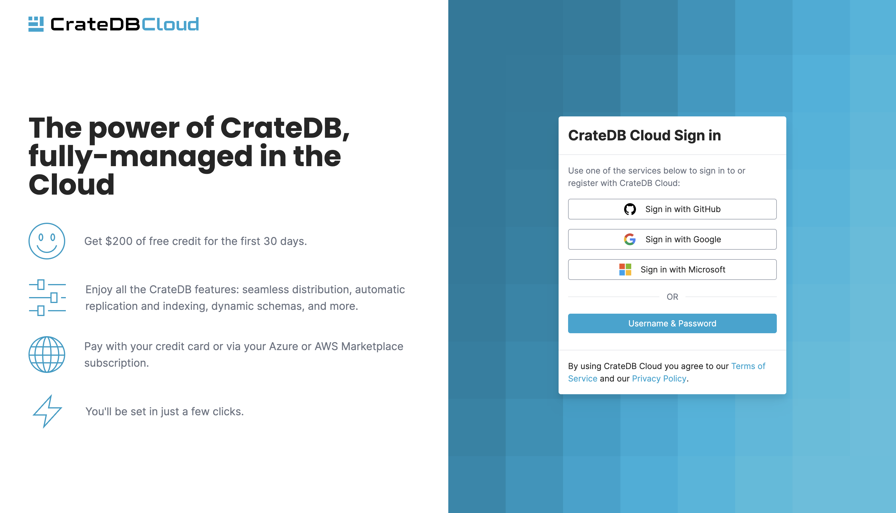

The CrateDB Cloud user interface permalink is the [CrateDB Cloud
Console](https://console.cratedb.cloud). You can [deploy a trial cluster
on the CrateDB Cloud Console for free](https://cratedb.com/lp-crfree).

Here is a list of all currently available regions for CrateDB Cloud:

:::{table}
:width: 700px
:widths: 200, 200, 100, 100
:align: left
| Region | Url |
|  ----  | ----|
| AWS West Europe | [eks1.eu-west-1.aws.cratedb.cloud](https://eks1.eu-west-1.aws.cratedb.cloud) |
| Azure East-US2 | [aks1.eastus2.azure.cratedb.cloud](https://eastus2.azure.cratedb.cloud/) |
| Azure West Europe | [aks1.westeurope.azure.cratedb.cloud](https://aks1.westeurope.azure.cratedb.cloud/) |
:::

Azure East-US2 and Azure West-Europe are managed by [Microsoft
Azure](https://azure.microsoft.com/en-us/). The AWS region is managed by
AWS and is located in Ireland. Note that the AWS region does not serve
the CrateDB Cloud Console directly.

From the Cloud Console homepage, you can sign in using a Github, Google,
or Microsoft Azure account or by creating a separate username and
password.

If you don't have a Cloud Console account yet, follow the steps in the
{ref}`signup tutorial <quick-start>`.
Select the authentication method you wish to use. From there, you will
be given the option to sign up.

Once signed in, you will be presented with the Organization overview.

(overview-org-overview)=
## Organization 

The organization is the highest structure in your CrateDB Cloud Console.
Multiple clusters and users can exist in a organization at any moment.
For first-time users, an organization called "My organization" is
automatically created upon first login.

To see a list of all the organizations you have access to, go to

the My Account page in the dropdown menu in the top-right.

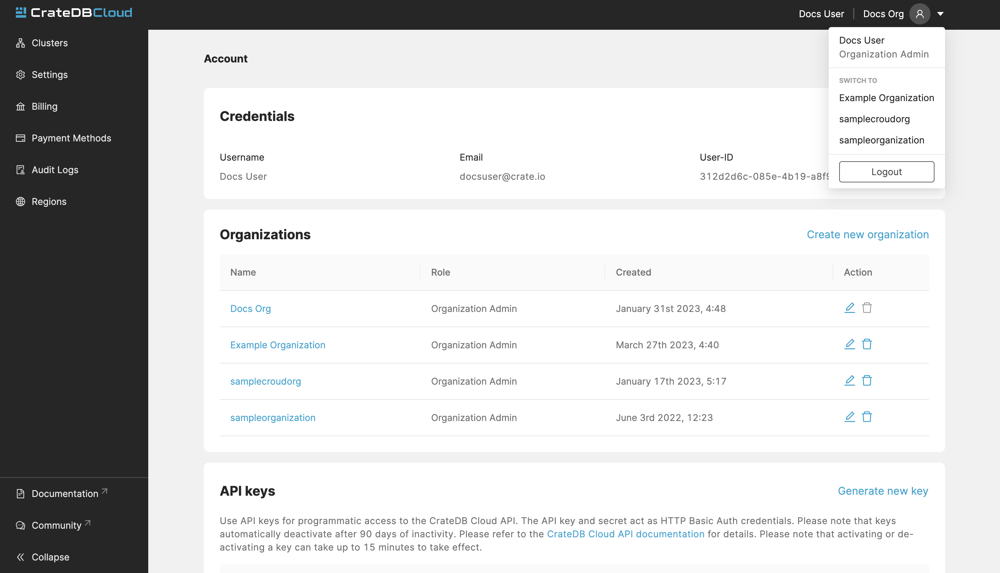

The Organization overview consists of six tabs: *Clusters*, *Settings*,
*Billing*, *Payment Methods*, *Audit Logs*, and *Regions*. By default
you are brought to the Clusters tab, which provides a quick overview of
all your clusters.

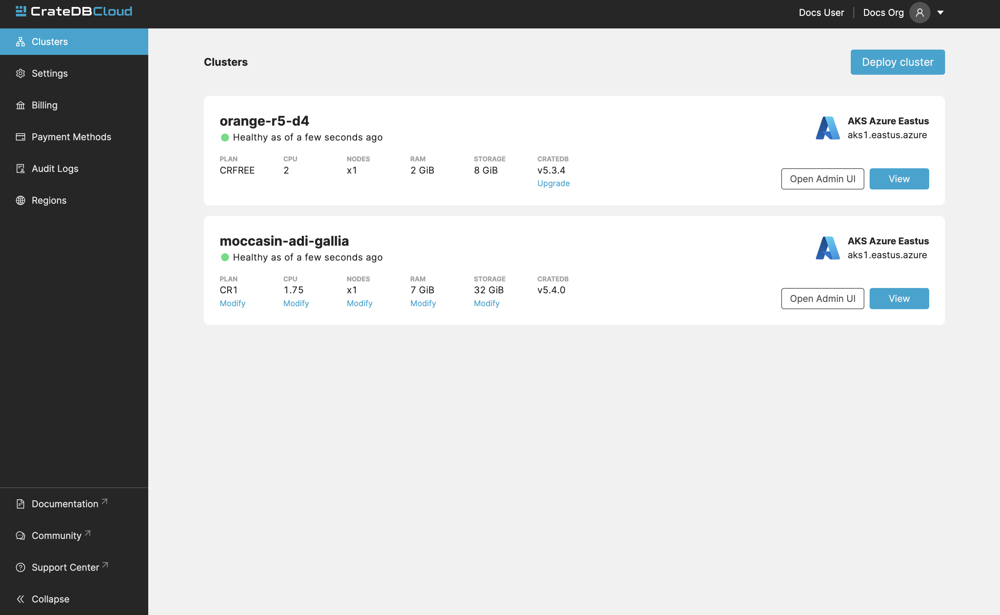

If you are a member of multiple organizations, you can quickly change
between them on every tab/page in the Cloud Console. Simply use the
dropdown menu at the top-right of the current page/tab:

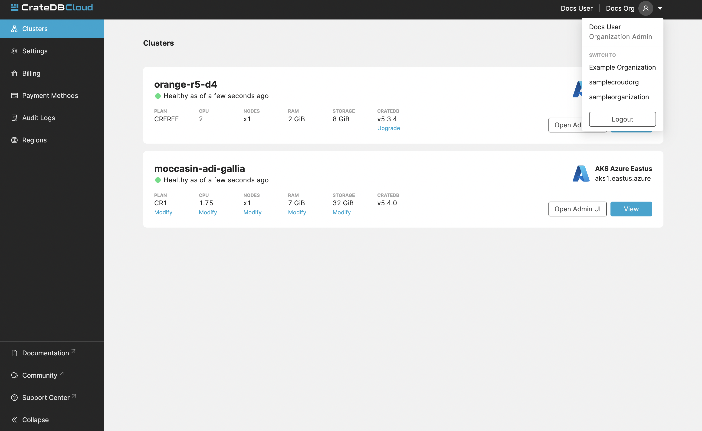

The CrateDB Cloud Console is structured on a per-organization basis: all
pages and tabs in the Console will display values for the currently
selected organization.

(overview-general-settings)=
### Settings 

The Settings tab shows you the name, notification settings, and ID of
your currently selected organization.

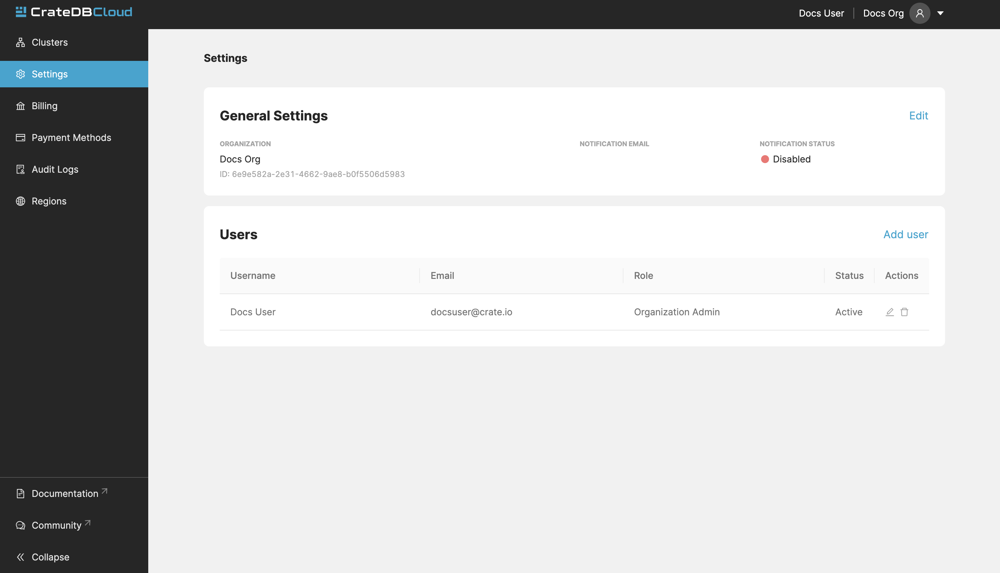

By clicking the *Edit* button next to the organization, you can rename
it. Here you can also set the email address for notifications and
indicate whether you want to receive them or not.

It also shows a list of users in your organization. You can add new
users by clicking the "Add user" button. You can also choose the role
of a new user. To learn more about user roles and their meaning, see the
documentation on [user
roles](https://cratedb.com/docs/cloud/en/latest/reference/user-roles.html).

(overview-org-billing)=
### Organization Billing 

The Billing tab shows all your existing subscriptions, along with which
cluster is currently using the subscription. The current accumulated
billing snapshot is also visible here, along with additional
information:

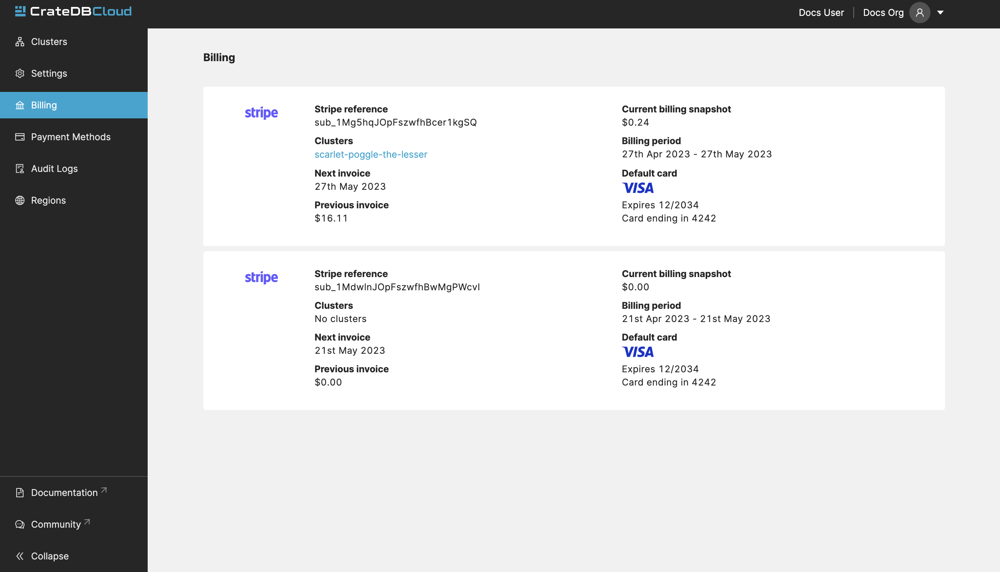

:::{note}
Subscriptions cannot be deleted in the billing tab. To delete a
subscription, please contact support.
:::

(overview-org-payment-methods)=
### Organization payment methods 

This tab shows all the information about your payment methods. If you
have signed up with a credit card for your cluster (the recommended
route), your card information overview will be shown here.

In case you use multiple cards, a default card can be set and cards can
be deleted from the list by using the dots icon to the right of the card
listing. Click the *Add payment method* button at the top right to add a
new card.

Cloud subscription payment methods can also be added here.

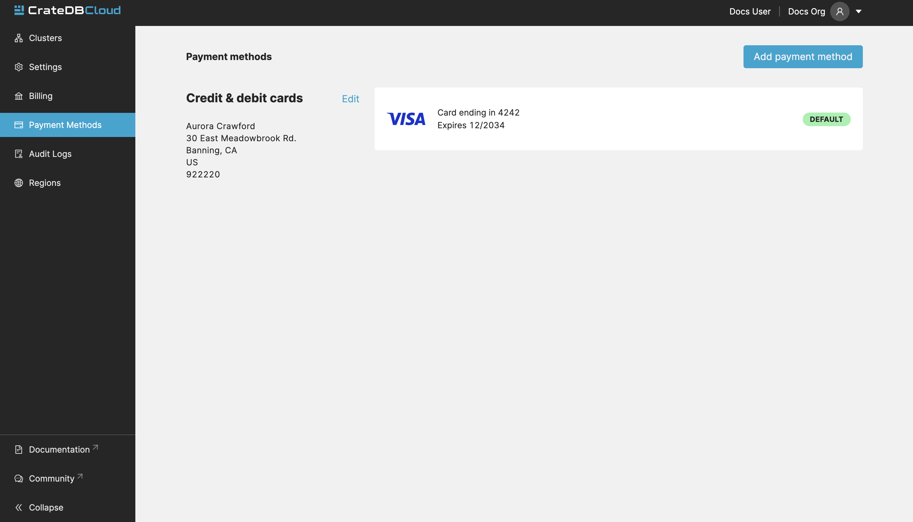

(overview-org-audit)=
### Organization Audit Logs 

This tab shows the Audit Logs of the current organization.

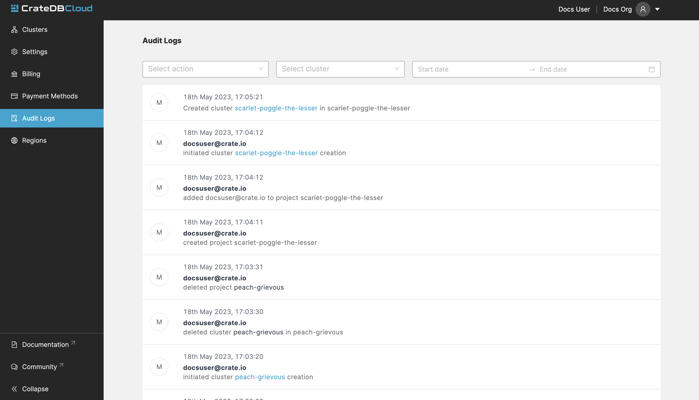

In the Audit Log, a user with the correct credentials ([an organization
admin](https://cratedb.com/docs/cloud/en/latest/reference/user-roles.html#organization-roles))
can see an overview of logged changes to the organization.

(overview-org-regions)=
### Organization Regions 

In this tab, you will see the available
{ref}`regions <gloss-region>` for cluster
deployment. It is possible to deploy clusters on this screen as well, by
clicking the *Deploy cluster* button under each respective region field.

For those with access to [CrateDB
Cloud on Kubernetes](https://cratedb.com/products/cratedb-edge/), this tab also allows the
deployment of {ref}`CrateDB Cloud on Kubernetes <gloss-cloud-on-kubernetes>`
clusters in a {ref}`custom region <gloss-region>`. To do so, provide a name
for the custom region and click the *Create edge region* button. Once
created, the custom region will appear:

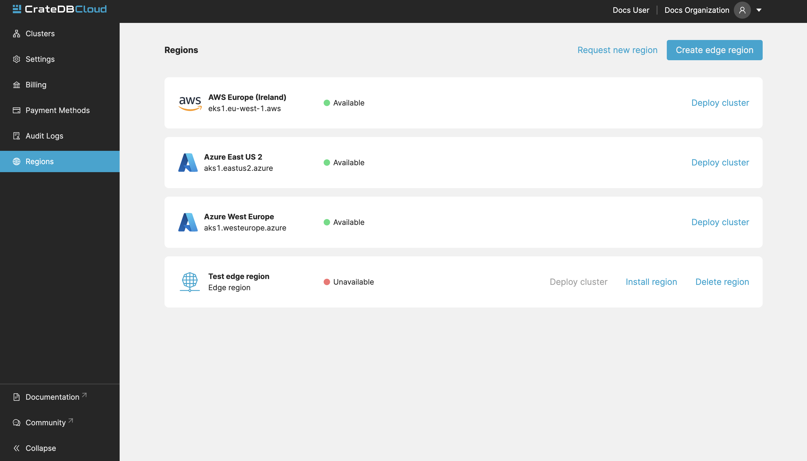

This field will show a script to set up the dependencies for cluster
deployment in the custom region. Apply the script in your local CLI and
follow the prompts to proceed. A `--help` parameter is available within
the script for further information.

(overview-cluster)=
## Cluster 

The detailed view of Cluster provides a broad range of relevant data of
the selected cluster. It also displays metrics for the cluster. It can
be accessed by clicking "View" on the desired cluster in the Clusters
tab.

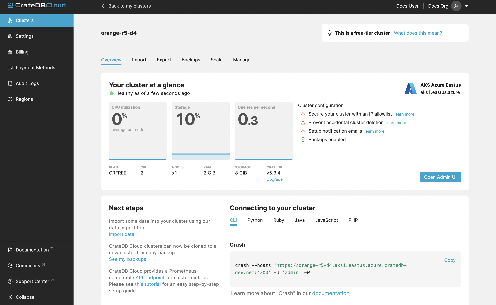

Information visible on the Overview page includes:

(overview-cluster-overview)=
### Overview 

-   **Status**: Current status of your cluster:
-   GREEN: Your cluster is healthy.
-   YELLOW: Some of your tables have under-replicated shards. Please log
    in to your cluster's Admin UI to check.
-   RED: Some of your tables have missing shards. This can happen if
    you've recently restarted a node. The support team is already
    notified and investigating the issue.
-   **Region**: Name of the region where the cluster is deployed.
-   **Plan**: This shows which
    {ref}`subscription plan <services>` 
    the cluster is running on.
-   **CPU metrics**: Average CPU utilization on average per node. The
    sparkline shows the trend for the last hour.
-   **Number of nodes**: Number of nodes in the cluster.
-   **RAM metric**: Percentage of ram used in each node on average. The
    sparkline shows the trend for the last hour.
-   **Storage metrics**: Used and overall storage of the cluster. The
    sparkline shows the trend for the last hour.
-   **Version**: This indicates the version number of CrateDB the
    cluster is running.
-   **Query metric**: Queries per second.

(overview-cluster-overview-admin-ui)=
#### Admin UI 

-   **Access cluster**: The *Open Admin UI* button connects you to the
    [CrateDB Admin UI](https://cratedb.com/docs/crate/admin-ui/en/latest/) for the
    cluster at its unique URL.

:::{note}
The Cluster URL points to a load balancer that distributes traffic
internally to the whole CrateDB cluster. The load balancer closes idle
connections after four minutes, therefore client applications that
require stateful connections (e.g., JDBC) must be configured to send
keep-alive heartbeat queries.
:::

(overview-cluster-overview-next-steps)=
#### Next Steps 

-   **Import Data**: Import some data into your cluster using the data
    import tool.
-   **See my backups**: The "see my backups" will take you to the
    Backups tab, where you can see all your backups. CrateDB Cloud
    clusters can now be cloned to a new cluster from any backup.
-   **API endpoint**: CrateDB Cloud provides a Prometheus-compatible API
    endpoint for cluster metrics.

For more information on the CrateDB concepts used here, refer to the
[CrateDB architecture
documentation](https://cratedb.com/docs/crate/howtos/en/latest/architecture/shared-nothing.html)
or the {ref}`glossary <glossary>`.

(overview-connect-to-your-cluster)=
#### Connecting to your cluster 

Here you can see a list of snippets for the available clients and
libraries. These include: CLI, Python, Ruby, Java, JavaScript, PHP.

(overview-cluster-query-console)=
### Query Console

The Query Console enables direct interaction with your CrateDB Cloud cluster
and running queries directly from within the Cloud UI. 

### Accessing and Using the Query Console

The Query Console can be found in the "Console" tab in the left-hand navigation
menu. 

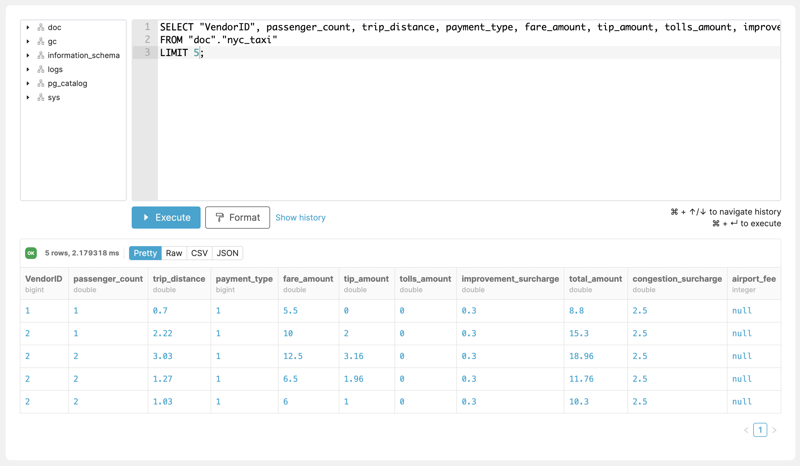

To the left side of the editor panel, there is a tree view that displays all
schemas and tables with corresponding columns.
The Query Console is able to run multiple queries at once.

Once you execute a query, the result output can be formatted and exported as
CSV or JSON.
In order to support self-service query debugging, there is an option to show
diagnostic output if an error occurs.

History of used queries can be accessed via the "Show history" button on the
bottom of the console. Here you can see all the executed queries and copy them 
or delete them from history.

```{note}
The Query Console is only available to organization admins.
```

(overview-import-tab)=
### Import 

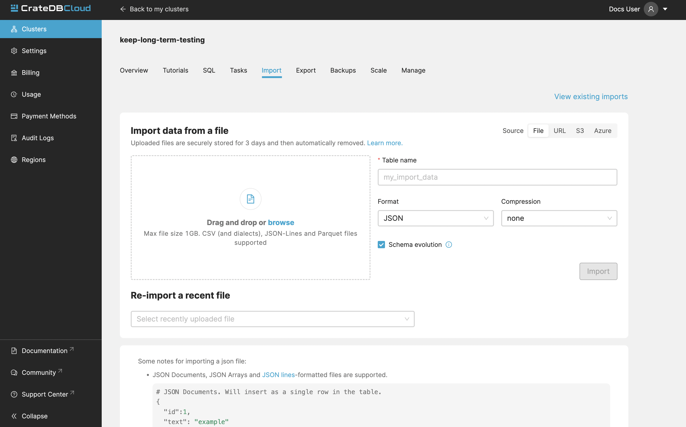

The first thing you see in the "Import" tab is the history of your
imports. You can see whether you imported from a URL or from a file,
file name, table into which you imported, date, and status. By clicking
"Show details" you can display details of a particular import.

Clicking the "Import new data" button will bring up the Import page,
where you can select the source of your data.

If you don't have a dataset prepared, we also provide an example in the
URL import section. It's the New York City taxi trip dataset for July
of 2019 (about 6.3M records).

(overview-cluster-import-url)=
#### Import from URL 

To import data, fill out the URL, name of the table which will be
created and populated with your data, data format, and whether it is
compressed.

If a table with the chosen name doesn't exist, it will be automatically
created.

The following data formats are supported:

-   CSV (all variants)
-   JSON (JSON-Lines, JSON Arrays and JSON Documents)
-   Parquet

Gzip compressed files are also supported.

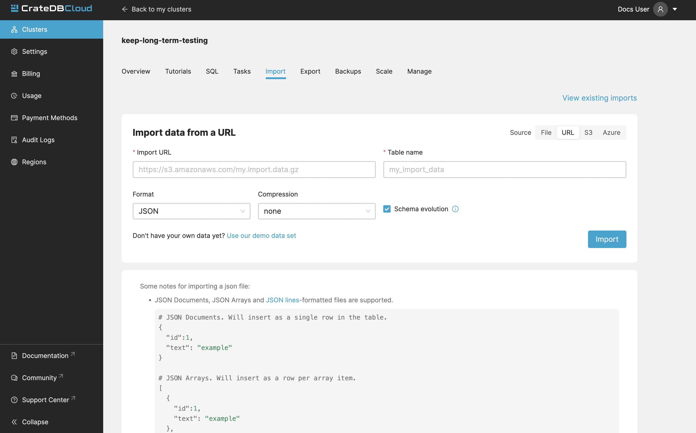

(overview-cluster-import-s3)=
#### Import from private S3 bucket 

CrateDB Cloud allows convenient imports directly from S3-compatible
storage. To import a file form bucket, provide the name of your bucket,
and path to the file. The S3 Access Key ID, and S3 Secret Access Key are
also needed. You can also specify the endpoint for non-AWS S3 buckets.
Keep in mind that you may be charged for egress traffic, depending on
your provider. There is also a volume limit of 10 GiB per file for S3
imports. The usual file formats are supported - CSV (all variants), JSON
(JSON-Lines, JSON Arrays and JSON Documents), and Parquet.

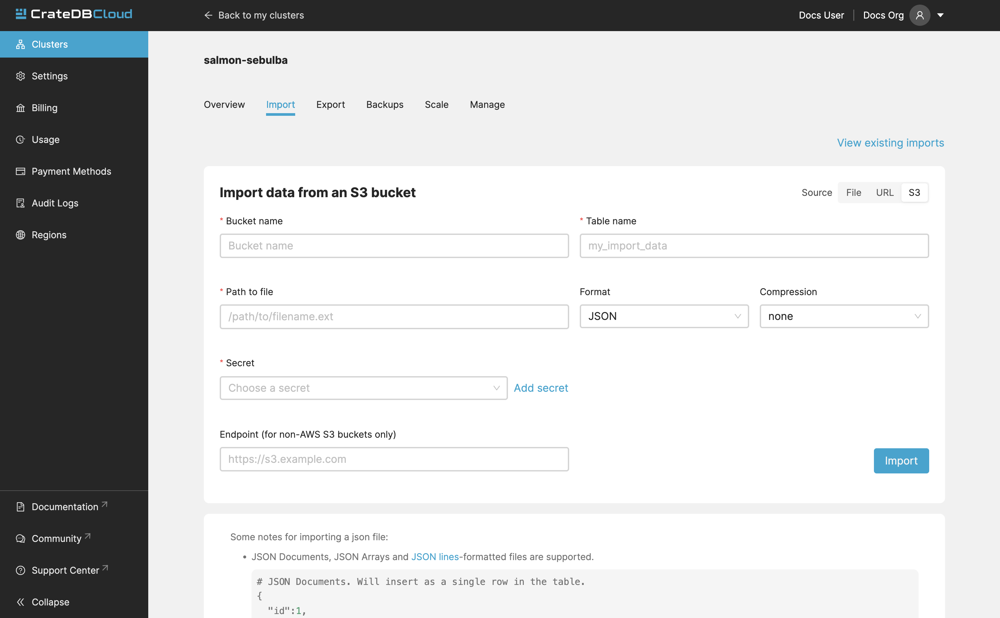

:::{note}
It's important to make sure that you have the right permissions to
access objects in the specified bucket. For AWS S3, your user should
have a policy that allows GetObject access, for example:

 :::{code}
 {
   "Version": "2012-10-17",
   "Statement": [
   {
       "Sid": "AllowGetObject",
       "Effect": "Allow",
       "Principal": {
           "AWS": "*"
       },
       "Action": "s3:GetObject",
       "Resource": "arn:aws:s3:::EXAMPLE-BUCKET-NAME/*"
   }]
   }
 :::
:::

(overview-cluster-import-azure)=
#### Import from Azure Blob Storage Container 

Importing data from private Azure Blob Storage containers is possible
using a stored secret, which includes a secret name and either an Azure
Storage Connection string or an Azure SAS Token URL. An admin user at
the organization level can add this secret.

You can specify a secret, a container, a table and a path in the form
[/folder/my_file.parquet]

As with other imports Parquet, CSV, and JSON files are supported. File
size limitation for imports is 10 GiB per file.

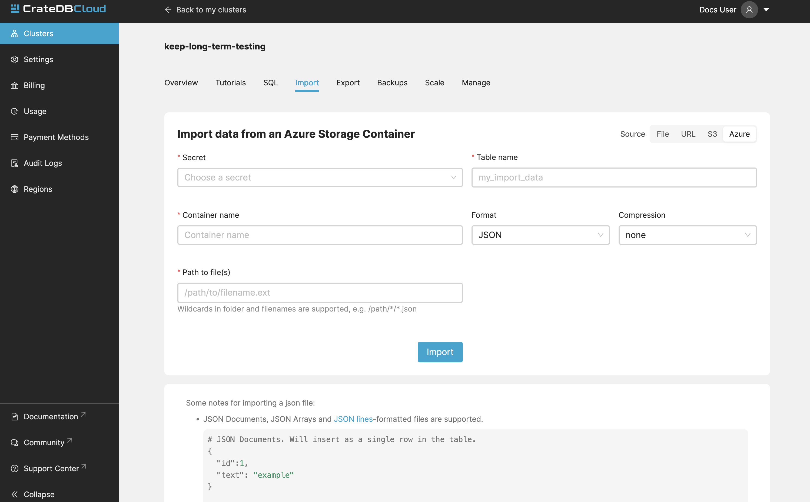

(overview-cluster-import-globbing)=
#### Importing multiple files 

Importing multiple files, also known as import globbing is supported in
any s3-compatible blob storage. The steps are the same as if importing
from S3, i.e. bucket name, path to the file and S3 ID/Secret.

Importing multiple files from Azure Container/Blob Storage is also
supported: `/folder/*.parquet`

Files to be imported are specified by using the well-known
[wildcard](https://en.wikipedia.org/wiki/Wildcard_character) notation,
also known as "globbing". In computer programming,
[glob](https://en.wikipedia.org/wiki/Glob_(programming)) patterns
specify sets of filenames with wildcard characters. The following
example would import all the files from the single specified day.

:::{code} console
/somepath/AWSLogs/123456678899/CloudTrail/us-east-1/2023/11/12/*.json.gz
:::

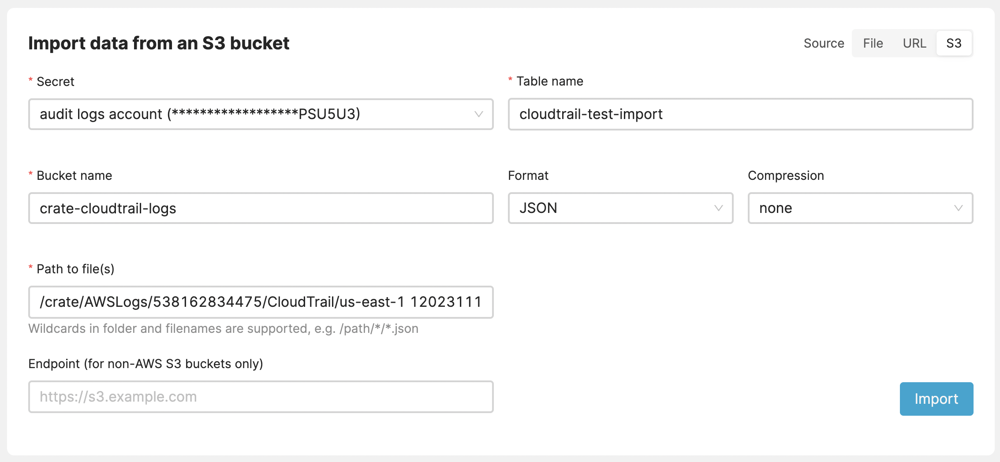

As with other imports, the supported file types are CSV, JSON, and
Parquet.

(overview-cluster-import-file)=
#### Import from file 

Uploading directly from your computer offers more control over your
data. From the security point of view, you don't have to share the data
on the internet just to be able to import it to your cluster. You also
have more control over who has access to your data. Your files are
temporarily uploaded to a secure location managed by Crate (an S3 bucket
in AWS) which is not publicly accessible. The files are automatically
deleted after 3 days. You may re-import the same file into multiple
tables without having to re-upload it within those 3 days. Up to 5 files
may be uploaded at the same time, with the oldest ones being
automatically deleted if you upload more.

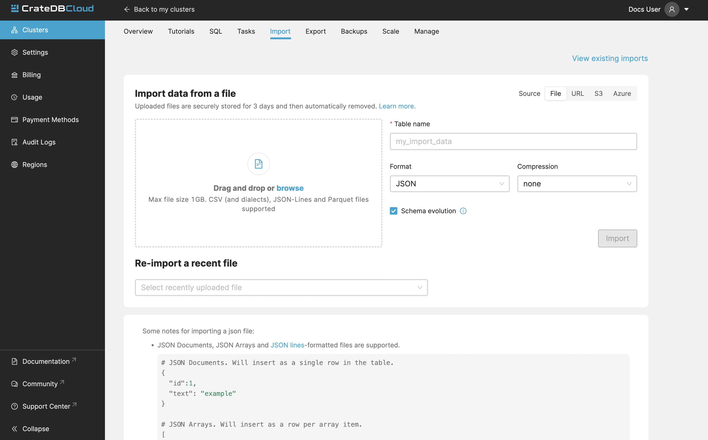

As with other import, the supported file formats are:

-   CSV (all variants)
-   JSON (JSON-Lines, JSON Arrays and JSON Documents)
-   Parquet

There is also a limit to file size, currently 1GB.

(overview-cluster-import-schema-evolution)=
#### Schema evolution 

Schema Evolution, available for all import types, enables automatic
addition of new columns to existing tables during data import,
eliminating the need to pre-define table schemas. This feature is
applicable to both pre-existing tables and those created during the
import process. It can be toggled via the 'Schema Evolution' checkbox
on the import page.

Note that Schema Evolution is limited to adding new columns; it does not
modify existing ones. For instance, if an existing table has an
'OrderID' column of type **INTEGER**, and an import is
attempted with Schema Evolution enabled for data where 'OrderID'
column is of type **STRING**, the import job will fail due to
type mismatch.

(overview-cluster-import-limitations)=
#### Import Limitations 

**CSV** files:

1.  Comma, tab and pipe delimiters are supported.

**JSON** files:

The following formats are supported for JSON:

1.  JSON Documents. Will insert as a single row in the table.

    :::{code} console
    {
      "id":1,
      "text": "example"
    }
    :::

2.  JSON Arrays. Will insert as a row per array item.

    :::{code} console
    [
      {
        "id":1,
        "text": "example"
      },
      {
        "id":2,
        "text": "example2"
      }
    ]
    :::

3.  JSON-Lines. Each line will insert as a row.

    :::{code} console
    {"id":1, "text": "example"}
    {"id":2, "text": "example2"}
    :::

(overview-cluster-export)=
### Export 

The export tab allows users to download specific tables/views. When you
first visit the Export tab, you can specify the name of a table/view,
format (CSV, JSON, or Parquet) and whether you'd like your data to be
gzip compressed (recommended for CSV and JSON files).

:::{note}
Parquet is a highly compressed data format for very efficient storage of
tabular data. Please note that for OBJECT and ARRAY columns in CrateDB,
the exported data will be JSON encoded when saving to Parquet
(effectively saving them as strings). This is due to the complexity of
encoding structs and lists in the Parquet format, where determining the
exact schema might not be possible. When re-importing such a Parquet
file, make sure you pre-create the table with the correct schema.
:::

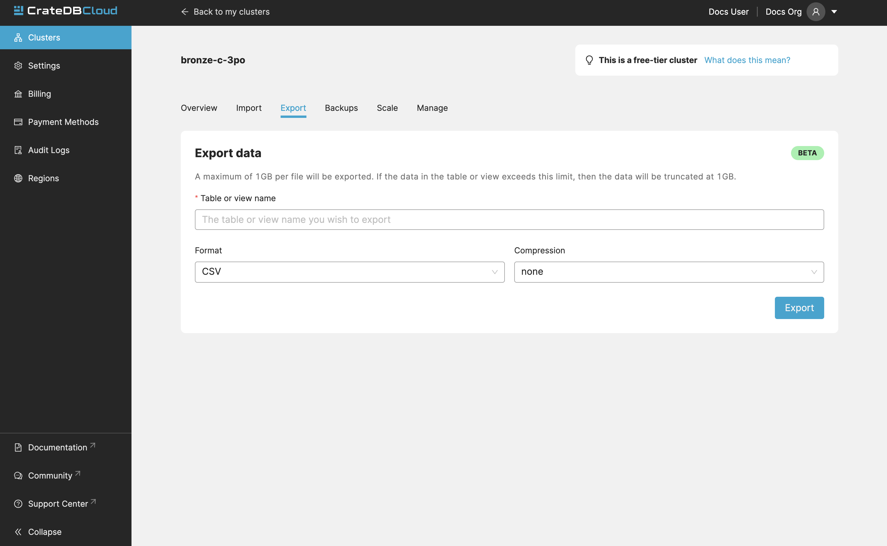

History of your exports is also visible in the Export tab.

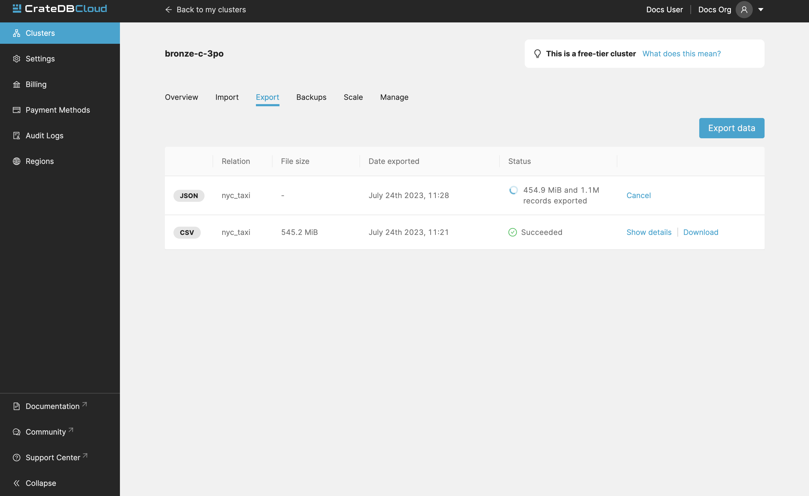

:::{note}
Export limitations:

-   Size limit for exporting is 1 GiB
-   Exports are held for 3 days, then automatically deleted
:::

(overview-cluster-backups)=
### Backups 

You can find the Backups page in the detailed view of your cluster and
you can see and restore all existing backups here.

By default, a backup is made every hour. The backups are kept for 14
days. We also keep the last 14 backups indefinitely, no matter the state
of your cluster.

The Backups tab provides a list of all your backups. By default, a
backup is made every hour.

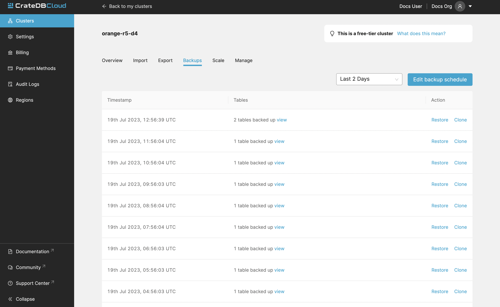

You can also control the schedule of your backups by clicking the *Edit
backup schedule* button.

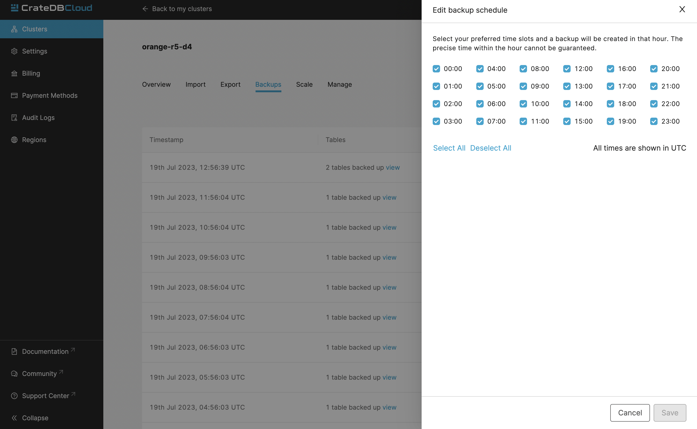

Here you can create a custom schedule by selecting any number of hour
slots. Backups will be created at selected times. At least one backup a
day is mandatory.

To restore a particular backup, click the *Restore* button. A popup
window with a SQL statement will appear. Input this statement to your
Admin UI console either by copy-pasting it, or clicking the *Run query
in Admin UI*. The latter will bring you directly to the Admin UI console
with the statement automatically pre-filled.

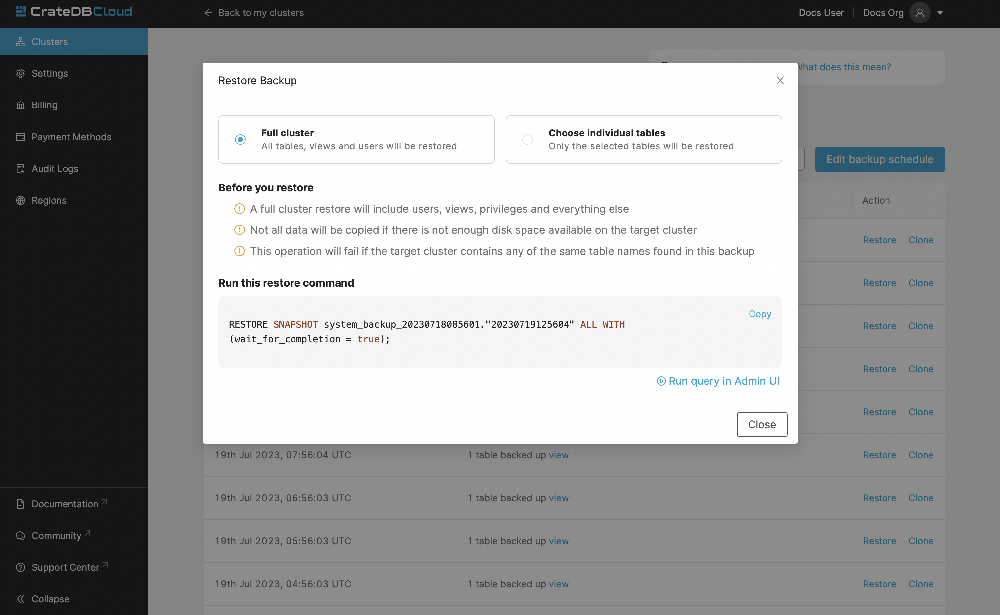

You have a choice between restoring the cluster fully, or only specific
tables.

(overview-cluster-cloning)=
#### Cluster Cloning 

Cluster cloning is a process of duplicating all the data from a specific
snapshot into a different cluster. Creating the new cluster isn't part
of the cloning process, you need to create the target cluster yourself.
You can clone a cluster from the Backups page.


Choose a snapshot and click the *Clone* button. As with restoring a
backup, you can choose between cloning the whole cluster, or only
specific tables.

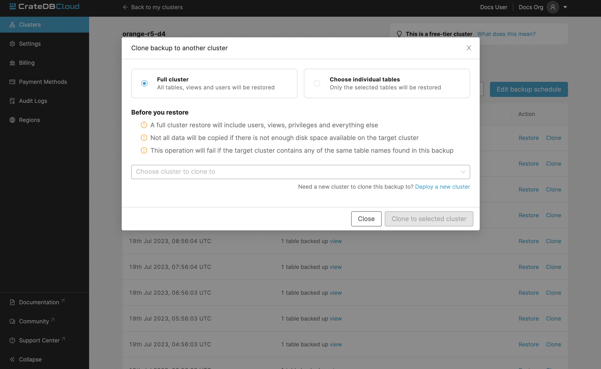

:::{note}
Keep in mind that the full cluster clone will include users, views,
privileges and everything else. Cloning also doesn't distinguish
between cluster plans, meaning you can clone from CR2 to CR1 or any
other variation.
:::

(overview-cluster-cloning-fail)=
#### Failed cloning 

There are circumstances under which cloning can fail or behave
unexpectedly. These are:

-   If you already have tables with the same names in the target cluster
    as in the source snapshot, the entire clone operation will fail.
-   There isn't enough storage left on the target cluster to
    accommodate the tables you're trying to clone. In this case, you
    might get an incomplete cloning as the cluster will run out of
    storage.
-   You're trying to clone an invalid or no longer existing snapshot.
    This can happen if you're cloning through
    [Croud](https://cratedb.com/docs/cloud/cli/en/latest/). In this case,
    the cloning will fail.
-   You're trying to restore a table that is not included in the
    snapshot. This can happen if you're restoring snapshots through
    [Croud](https://cratedb.com/docs/cloud/cli/en/latest/). In this case,
    the cloning will fail.

When cloning fails, it is indicated by a banner in the cluster overview
screen.

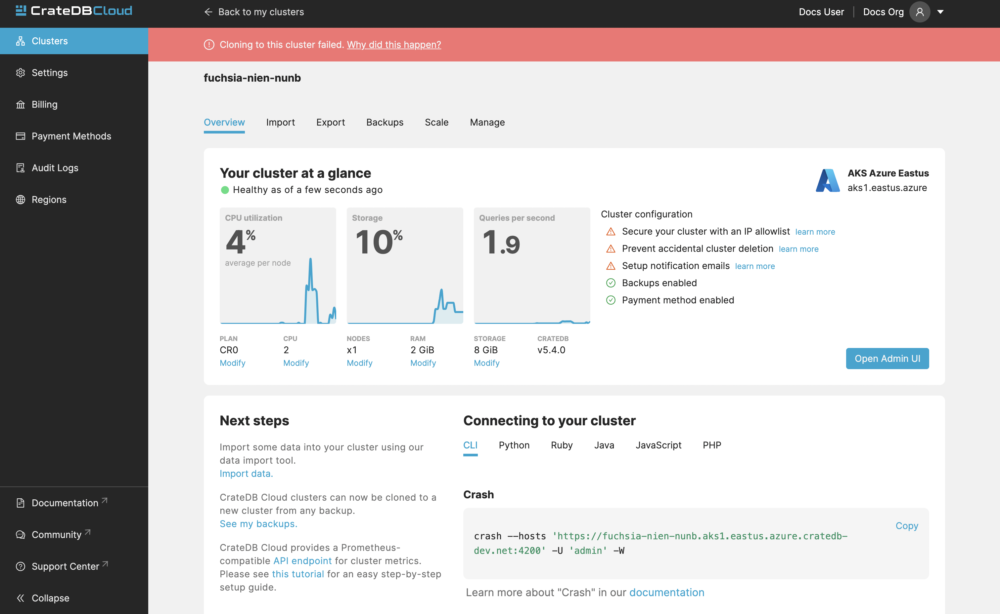

(overview-sql-scheduler)=
### SQL Scheduler

The SQL Scheduler is designed to automate routine database tasks by scheduling 
SQL queries to run at specific times, in UTC time. This feature
supports creating job descriptions with valid 
[cron patterns](https://www.ibm.com/docs/en/db2oc?topic=task-unix-cron-format) 
and SQL statements, enabling a wide range of tasks. Users can manage these jobs
through the Cloud UI, adding, removing, editing, activating, and deactivating
them as needed.

#### Use Cases

- Deleting old/redundant data to maintain database efficiency.
- Regularly updating or aggregating table data.
- Automating export and import of data.

:::{note}
- The SQL Scheduler is automatically available for all newly deployed clusters.
- For existing clusters, the feature can be enabled on demand. 
  (Contact support for activation.)
:::

#### Accessing and Using the SQL Scheduler

SQL Scheduler can be found in "SQL Scheduler" tab in the left-hand navigation
menu. There are 2 tabs on the SQL Scheduler page:

:::{tab} Overview
<br>

**Overview** shows a list of your existing jobs. In the list you can
activate/deactivate each job with a toggle in the "Active" column. You can
also edit and delete jobs with buttons on the right side of the list.
  
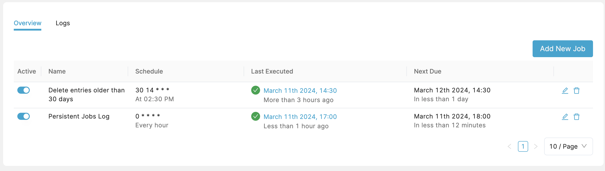
:::

:::{tab} Logs
<br>

**Logs** shows a list of *scheduled* job runs, whether they failed or
succeeded, execution time, run time, and the error in case they were
unsuccessful. In case of an error, more details can be viewed showing the
executed query and a stack trace. You can filter the logs by status, or by
specific job.

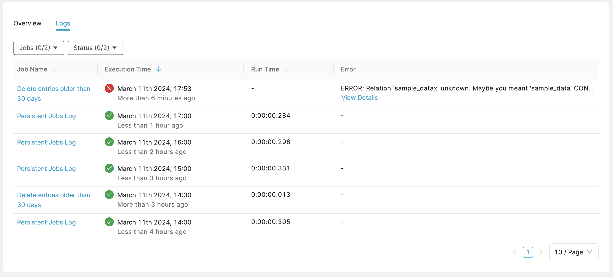
:::

#### Examples

::::{tab} Cleanup of old files
<br>

Cleanup tasks represent a common use case for these types of automated jobs. 
This example deletes records older than 30 days, from a specified table once a 
day:

:::{code} sql
DELETE FROM "sample_data"
WHERE
  "timestamp_column" < NOW() - INTERVAL '30 days';
:::

How often you run it of course depends on you, but once a day is common for
clean up. This expression runs every day at 2:30 PM UTC:

Schedule: `30 14 * * *`
  
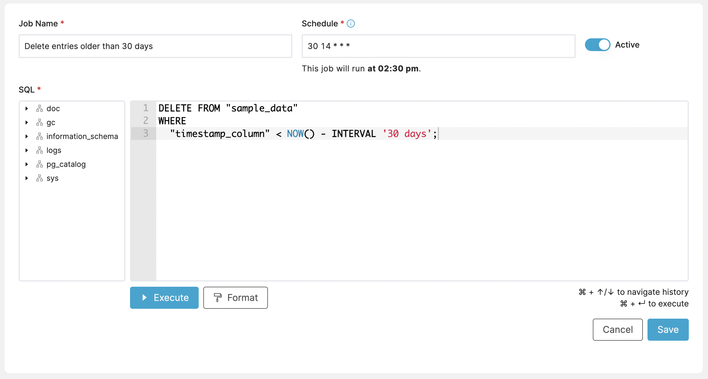
::::

::::{tab} Copying logs into persistent table
<br>

Another useful example might be copying data to another table for archival 
purposes. This specifically copies from system logs table into one of our
own tables.

:::{code} sql
CREATE TABLE IF NOT EXISTS "logs"."persistent_jobs_log" (
  "classification" OBJECT (DYNAMIC),
  "ended" TIMESTAMP WITH TIME ZONE,
  "error" TEXT,
  "id" TEXT,
  "node" OBJECT (DYNAMIC),
  "started" TIMESTAMP WITH TIME ZONE,
  "stmt" TEXT,
  "username" TEXT,
  PRIMARY KEY (id)
) CLUSTERED INTO 1 SHARDS;

INSERT INTO
  "logs"."persistent_jobs_log"
SELECT
  *
FROM
  sys.jobs_log
ON CONFLICT ("id") DO NOTHING;
:::

In this example, we schedule the job to run every hour:

Schedule: `0 * * * *`


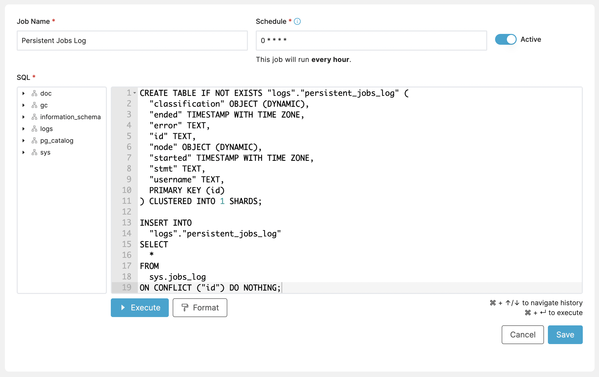
::::

:::{note}
Limitations and Known Issues:

* Only one job can run at a time; subsequent jobs will be queued until the 
  current one completes.
* Long-running jobs may block the execution of queued jobs, leading to
  potential delays.
:::

(overview-table-policies)=
### Table Policies

Table policies allow to automate maintenance operations for 
**partitioned tables**. Automated actions can be set up that are be 
executed daily based on pre-configure ruleset.

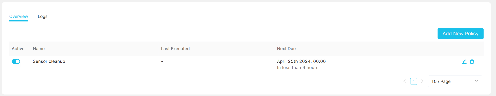
:::

Table policy overview can be found in the left-hand navigation menu under 
"Table Policies". From the list of policies, you can create, delete, edit, 
or (de)activate them. 

Log of executed policies can be found in the "Logs" tab. 

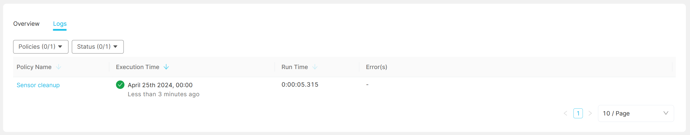
:::

A new policy can be created with "Add New Policy" button.

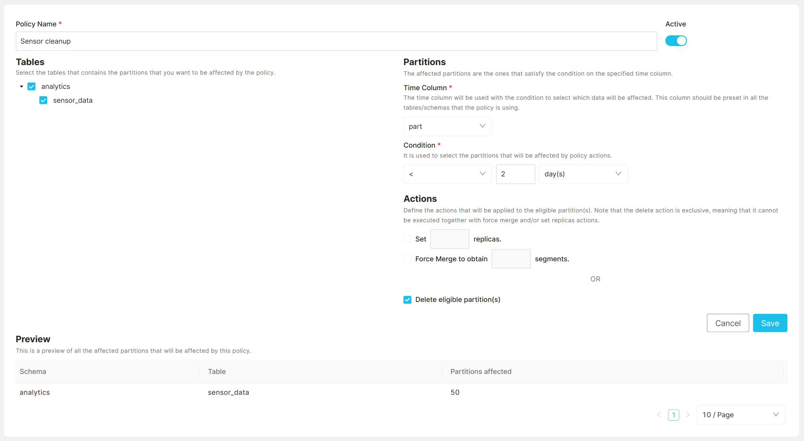
:::

After naming the policy and selecting the tables/schemas to be impacted, you
must specify the time column. This column, which should be a timestamp used for
partitioning, will determine the data affected by the policy. It is important
that this time column is consistently present across all targeted
tables/schemas. While you can apply the policy to also tables without the
specificed time column, it will not get executed for those. If your tables have
different timestamp columns, consider setting up separate policies for each to
ensure accuracy.

:::{note}
The "Time Column" must be of type `TIMESTAMP`.
:::

Next, a condition is used to determine affected partitions. The system is
time based. A partition is eligible for action if the value in the 
partitioned column is smaller (`<`), or smaller or equal (`<=`) than the current
date minus `n` days, months, or years.

(overview-table-policies-actions)=
#### Actions

Following actions are supported:
* **Delete:** Deletes eligible partitions along with their data.
* **Set replicas:** Changes the replication factor of eligible partitions.
* **Force merge:** Merges segments on eligible partitions to ensure a specified
  number.

After filling out the info, you can see the affected schemas/tables and
the number of affected partitions if the policy gets executed at this very moment.

(overview-table-policies-usage)=
#### Examples

Consider a scenario where you have a table and wish to optimize space on your
cluster. For older data, which might already be snapshoted, it may be sufficient
for it to exist just once in the cluster without replication. In such cases,
high availability is not a priority, and you plan to retain the data for only
60 days.

Assume the following table schema:

:::{code} sql
CREATE TABLE data_table (
   ts TIMESTAMP,
   ts_day GENERATED ALWAYS AS date_trunc('day',ts),
   val DOUBLE
) PARTITIONED BY (ts_day);
:::

For the outlined scenario, the policies would be as follows:

**Policy 1 - Saving replica space:**
* **Time Column:** `ts_day`
* **Condition:** `older than 30 days`
* **Actions:** `Set replicas to 0.`

**Policy 2 - Data removal:**
* **Time Column:** `ts_day`
* **Condition:** `older than 60 days`
* **Actions:** `Delete eligible partition(s)`
(overview-cluster-settings-scale)=
### Scale 

In the Scale tab, current configuration of your cluster is shown. You
can see your current plan, resources of a single node, and overall
resources of the cluster.

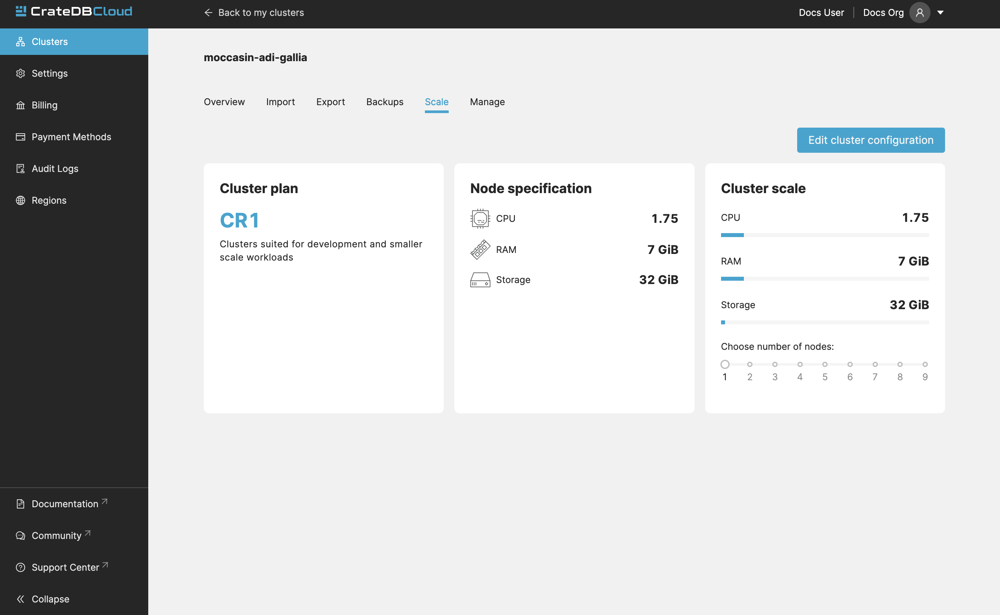

You can scale your cluster by clicking the *Edit cluster configuration*
button in the top-right:

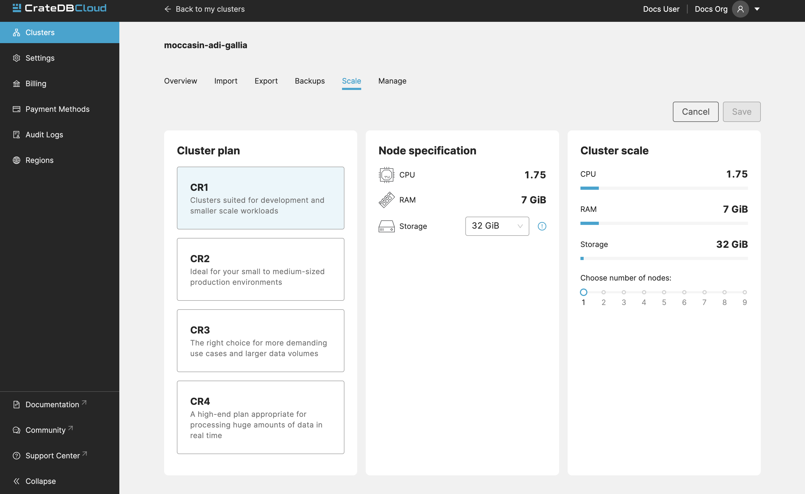

Now you can do three different things:

-   Change the plan of your cluster
-   Increase storage on each node
-   Increase/decrease the number of nodes

You can do only one of those operations at a time, i.e. you can't
change plans and scale the number of nodes at the same time.

The difference in price of the cluster can be seen on the bottom right,
when choosing different configurations.

:::{note}
Any promotions or discounts applicable to your cluster will be applied
for your organization as a whole at the end of the billing period. Due
to technical limitations, they may not be directly visible in the
cluster scale pricing shown here, but do not worry! This does not mean
that your promotion or discount is not functioning.
:::

:::{warning}
Storage capacity increases for a given cluster are irreversible. To
reduce cluster storage capacity, reduce the cluster nodes instead (up to
a minimum of 2, although we recommend maintaining a minimum of 3 for
production use).
:::

(overview-cluster-manage)=
### Manage 

The manage tab contains credentials settings, deletion protection,
upgrades, IP allowlist, private links, suspend cluster, and delete
cluster options.

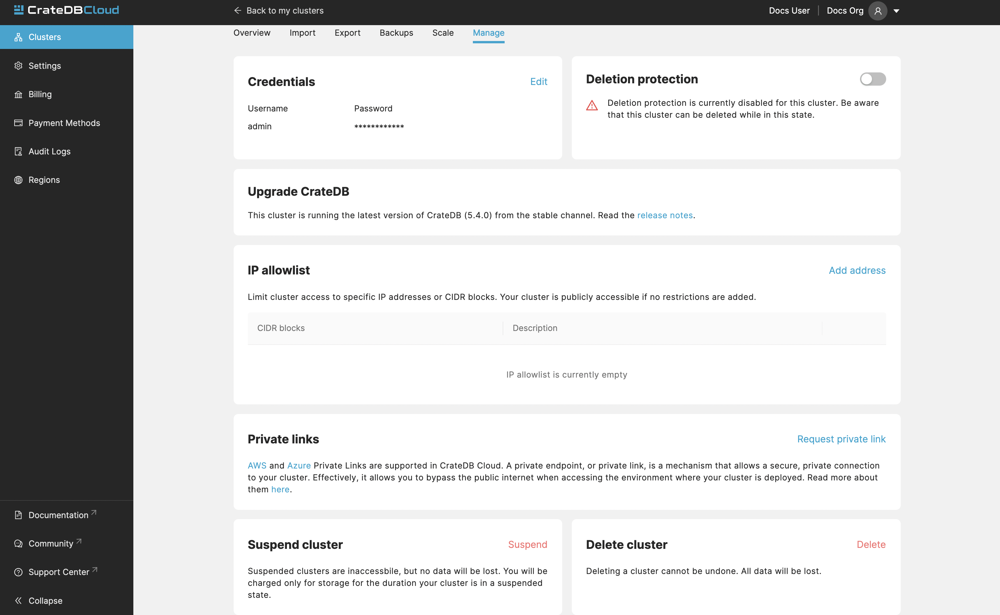

-   **Credentials** - These are the username and password used for
    accessing the Admin UI of your cluster. Username is always admin and
    the password can be changed.

-   **Deletion protection** - While this is enabled, your cluster cannot
    be deleted.

-   **Upgrade CrateDB** - Here you can enable the CrateDB version
    running on your cluster.

-   **IP Allowlist** - By using the IP allowlisting feature, you can
    restrict access to your cluster to an indicated IP address or [CIDR
    block](https://www.keycdn.com/support/what-is-cidr). Click the blue
    *Add Address* button and you can fill out an IP address or range and
    give it a meaningful description. Click *Save* to store it or the
    bin icon to delete a range. Keep in mind that once IP allowlisting
    has been set, you cannot access the Admin UI for that cluster from
    any other address.

    If no allowlist address or address range is set, the cluster is
    publicly accessible by default. (Of course, the normal
    authentication procedures are always required.) Only an
    {ref}`org admin <org-roles>` can change the allowlist.

-   **Private links** - A private endpoint, or private link, is a
    mechanism that allows a secure, private connection to your cluster.
    Effectively, it allows you to bypass the public internet when
    accessing the environment where your cluster is deployed. Note that
    private endpoints don't work across providers, meaning that if you
    want to securely access your AWS cluster, you must do so from within
    the AWS environment.

-   **Suspend cluster** Cluster suspension is a feature that enables you
    to temporarily pause your cluster while retaining all its data. An
    example situation might be that the project you're working on has
    been put on hold. The cost of running a cluster is split into two
    parts: Compute and Storage. The benefit here is that while the
    cluster is suspended, you are only charged for the storage.

-   **Delete cluster** All cluster data will be lost on deletion. This
    action cannot be undone.

(overview-community)=
## Community 

The Community link goes to the [CrateDB and CrateDB Cloud Community
page](https://community.cratedb.com/). Here you can ask members of the
community and Crate.io employees questions about uncertainties or
problems you are having when using our products.
