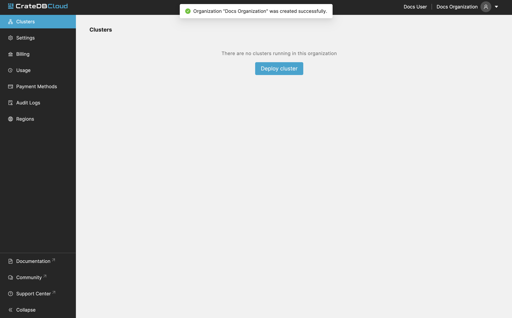

.. _free-trial-budget:
.. _free-trial-budget-signup:

==========
Free Trial
==========

This section explains the free trial budget offering, assigning any new
user free credits worth $65. The credits can be used on any cluster
configuration.

.. _free-trial-budget-account:

Create an account
=================

To be eligible for free credits, the first step is to
:ref:`sign up <sign-up>` for an account.

.. _free-trial-budget-org:

Create an organization
======================

To receive the free credits, first :ref:`create an organization <create-org>`.

Enter the name for the new organization, and select *Create organization*.
Once this is done, you will be redirected to the "Clusters Overview" page,
displaying your available credits.

After that, you can follow the :ref:`cluster deployment tutorial
<cluster-deployment-stripe>`, to get your first cluster running.

.. NOTE::

    A few notes about the free credits.
     
    - Credits can be spent on any cluster configuration
    - Credits are valid for 30 days after creating the organization
    - Billing starts when free credits are consumed or expired
    - It is possible to deploy multiple clusters
    - It is possible to scale clusters
