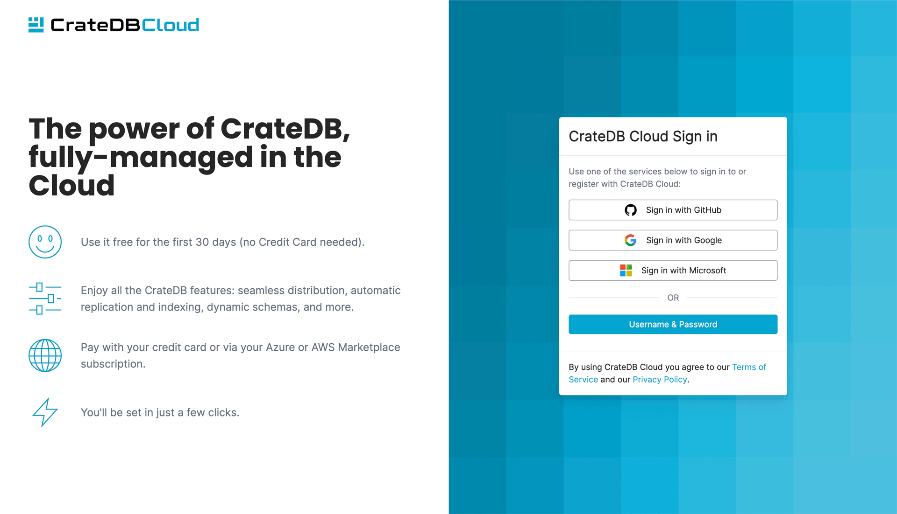
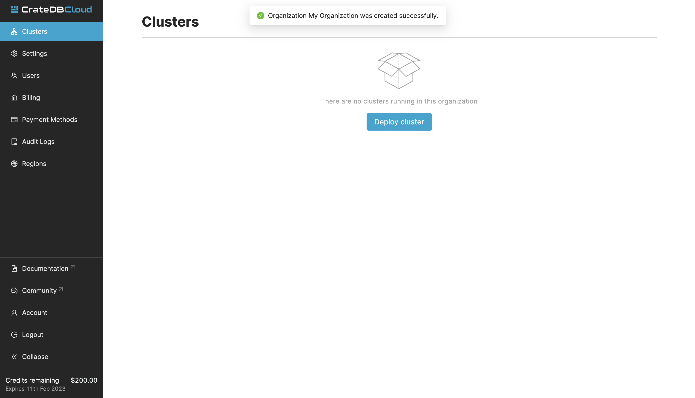

.. _sign-up:

=======
Sign Up
=======

Before you can start using :ref:`CrateDB Cloud <index>`, you need to sign up
for a user account.

As a CrateDB Cloud user, you can create and manage organizations.
As an organization administrator, you can also manage other CrateDB Cloud
users, and launch CrateDB Cloud clusters and other CrateDB Cloud
products.

CrateDB Cloud supports signing up using several authentication providers
and methods: You can use an account at GitHub, Google, or Microsoft Azure,
or create a separate username and password supported by Amazon Cognito.

Quick start.

.. card:: :octicon:`table;2em` CrateDB Cloud Console
    :link: https://console.cratedb.cloud/
    :link-type: url

    Directly navigate to the CrateDB Cloud Console.
    https://console.cratedb.cloud/

.. note::

    If you intend to subscribe and deploy a cluster using a credit card - the
    recommended procedure - any of the signup methods will work. When coming
    from the Software as a Service (SaaS) marketplaces, a few restrictions
    may apply.

.. note::

    Only the *Microsoft* option allows you to deploy clusters on CrateDB
    Cloud when coming from the Microsoft Azure Marketplace. Similarly, for cluster
    deployment through AWS, you should use the Amazon Cognito signup service. The
    Cognito authentication service is indicated in the UI as *Username & Password*.
    Both signup processes are described below.

.. seealso::

    To go directly to the cluster deployment tutorials, see :ref:`cluster-deployment`.

.. rubric:: Table of contents

.. contents::
   :local:

.. _sign-up-github:
.. _sign-up-google:
.. _sign-up-azure:

Sign up via SSO
===============

Visit the `CrateDB Cloud Console`_. You will be able to select the
corresponding authentication provider on the right hand side of the
screen.

.. _sign-up-username-password:

Sign up with Username & Password
================================

If you select the *Username & Password* sign-in method (supported by Amazon
Cognito), you should be presented with a username and password login page,
where you will need to "Sign up" before signing in. Within this process, you
will receive an email including an authorization code, so please make sure
to use a valid email address.

.. _sign-up-sign-in:

Sign in
=======

Once you signed in, you will be redirected to the CrateDB Cloud Console.
The first thing to do is to :ref:`create an organization <create-org>`.

For more information on how the CrateDB Cloud Console works, refer to the
:ref:`console-overview` documentation.

.. _sign-up-next:

Next steps
==========

Corresponding tutorials will guide you through the process of creating an
organization and database cluster, see :ref:`cluster-deployment`.

.. tip::

    To get started easily, there are two options:

    - The :ref:`free-trial-budget` will give any new user free credits
      worth $200, which can be used on any kind of cluster configuration.

    - The :ref:`crfree` cluster subscription plan is aimed at new users
      who want to test and evaluate CrateDB Cloud.

.. _CrateDB Cloud Console: https://console.cratedb.cloud/
